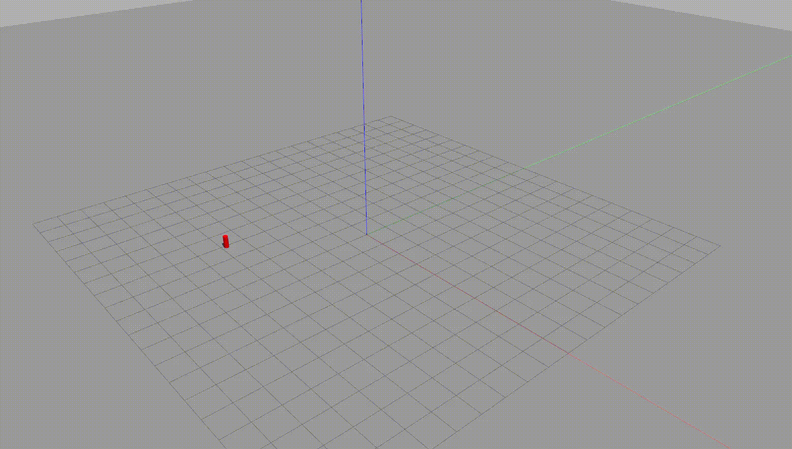

### ros2-randomly-generate-obstacles

**Introduction**

This package is used to randomly generate obstacles in gazebo.

**How to use? -- rolling**
```bash
colcon build

source install/setup.bash

ros2 run random_obs_map generate.launch.py
```

**result**

